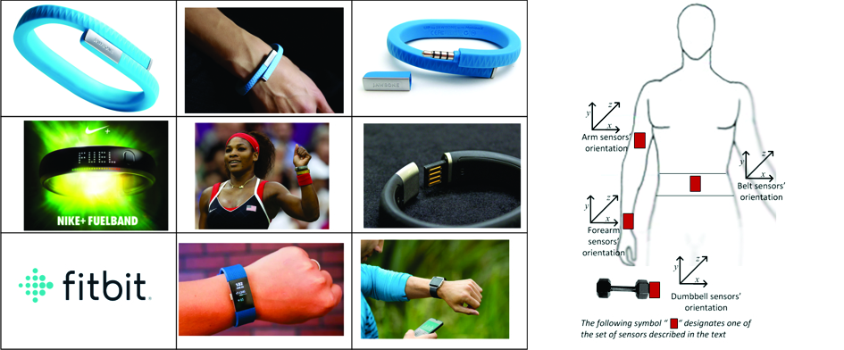

---
title: 'Are you doing right your exercises? '
author: "CWerneck - Claudia Werneck"
date: "january, 25, 2018"
output:
  html_document: default
  pdf_document: default
---  

###**Abstract**  
#####This analysis corresponds to the Project Assignment for the **Practical Machine Learning** course of the Johns Hopkins Bloomberg School of Public Health **Data Science Specialization** at Coursera. 
#####Using devices such as *Jawbone Up*, *Nike FuelBand*, and *Fitbit* it is now possible to collect a large amount of data about personal activity relatively inexpensively.  
  

#####These type of devices are part of the quantified self movement - a group of enthusiasts who take measurements about themselves regularly to improve their health, to find patterns in their behavior, or because they are tech geeks.   
#####One thing that people regularly do is quantify **how much** of a particular activity they do, but they rarely quantify **how well** they do it.  
#####In this project, the goal is: using data from accelerometers on the belt, forearm, arm, and dumbell of 6 participants, predict the manner in which they did the exercises. They were asked to perform barbell lifts correctly and incorrectly in 5 different ways:  A - the correct way and B, C, D e E, four different wrong ways of do the exercise. This is the *"classe"* variable in the training set. It will be select any of the other variables to predict with.   
#####More information is available from the website here:   http://web.archive.org/web/20161224072740/http:/groupware.les.inf.puc-rio.br/har  (see the section on the Weight Lifting Exercise Dataset) and if you use the document you create for this class, for any purpose, please cite them as they have been very generous in allowing their data to be used for this kind of assignment.  
#####The training and test data for this project are available in this two url's:  
######https://d396qusza40orc.cloudfront.net/predmachlearn/pml-training.csv  
######https://d396qusza40orc.cloudfront.net/predmachlearn/pml-testing.csv  
***
###**Data Processing**
````{r message=FALSE}

library(caret); library(rattle); library(rpart); library(rpart.plot)
library(randomForest); library(corrplot)
#Load the imported data from local 
trainRead<-read.csv("C:/Coursera/08_Practical_Machine_learning/pml-training.csv", na.strings=c("NA","#DIV/0!", ""))  
testRead<-read.csv("C:/Coursera/08_Practical_Machine_learning/pml-testing.csv", na.strings=c("NA","#DIV/0!", ""))
dim(trainRead);dim(testRead)
#Once we want use the columns as predictors, we must eliminate all the columns that do not have information.
trainClean<-trainRead[,colSums(is.na(trainRead))==0]
testClean<-testRead[,colSums(is.na(testRead))==0]
#that reduces the columns to only 60 columns
dim(trainClean);dim(testClean)
#Investigating the data we can see that the seven first columns have a sequencial number (the first)
#and variations of the timestamp that we are not using for this analysis so we will eliminate those columns remaining 53
trainOK<-trainClean[,-c(1:7)]
testOK<-testClean[,-c(1:7)]
dim(trainOK);dim(testOK)
#And now we are with the Dataset to proceed the study  and will see if there are correlation among the variables used.
exerCorrmatrix<-cor(trainOK[sapply(trainOK, is.numeric)])  
tiff(file="corrnew.tif", res=96, width=1000, height=1000)  
corrplot(exerCorrmatrix,order="FPC", method="circle", tl.cex=0.45, tl.col="black", number.cex=0.25)  
title("Correlation Matrix of the variables used", line = 1)

````  
  
###**Create the datasets**   
````{r message=FALSE}
inTrain<-createDataPartition(trainOK$classe, p=3/4, list=FALSE)
train<-trainOK[inTrain,]
valid<-trainOK[-inTrain,]   
````   
#####analysing the principal components, we got that 25 components are necessary to capture .95 of the variance. But it demands alot of machine processing so, we decided by a .80 thresh to capture 80% of the variance using 12 components
````{r message=FALSE}
set.seed(2018)
PropPCA<-preProcess(train,method="pca", thresh=0.8)
PropPCA
#create the preProc object, excluding the response (classe)
preProc  <- preProcess(train[,-53], 
                       method = "pca",
                       pcaComp = 12, thresh=0.8) 
#Apply the processing to the train and test data, and add the response 
#to the dataframes
train_pca <- predict(preProc, train[,-53])
train_pca$classe <- train$classe
#train_pca has only 12 principal components plus classe
valid_pca <- predict(preProc, valid[,-53])
valid_pca$classe <- valid$classe
#valid_pca has only 12 principal components plus classe

###**Choose algorithms to predict**
#####Two methods will be tested, gbm=Generalized Boosted Regression and rf=Random Forest  
### GBM  
#fit_gbm<-train(classe ~., data=train_pca, method="gbm")
print(fit_gbm, digits=4)  
predict_gbm<-predict(fit_gbm,valid_pca)  
(conf_gbm<-confusionMatrix(valid_pca$classe, predict_gbm))
(accuracy_gbm<-conf_gbm$overall['Accuracy'])
###rf
#fit_rf<-train(classe ~., data=train_pca, method="rf")
print(fit_rf, digits=4)  
predict_rf<-predict(fit_rf,valid_pca)  
(conf_rf<-confusionMatrix(valid_pca$classe, predict_rf))
(accuracy_rf<-conf_rf$overall['Accuracy'])
````  
####We can now say that for this dataset, **random forest** method is better than Generalized Boosted Regression and the **accuracy** obtained would be **0.9611** 
***
###**Results - Prediction on Testing Set**
#####Applying the **Random Forest** to predict the outcome variable classe for the **test** set
````{r message=FALSE}
test_pca <- predict(preProc, testOK[,-53])
test_pca$problem_id <- testOK$problem_id
(predict(fit_rf, test_pca))
````
#####**with those 20 predictions we conclude the Course Project**
#####If you have one of those devices, to get your data, try to do the exercises and discover if you are doing them in the right way.
***
###**References**
#####Ugulino, W.; Cardador, D.; Vega, K.; Velloso, E.; Milidiu, R.; Fuks, H. Wearable Computing: Accelerometers' Data Classification of Body Postures and Movements. Proceedings of 21st Brazilian Symposium on Artificial Intelligence. Advances in Artificial Intelligence - SBIA 2012. In: Lecture Notes in Computer Science. , pp. 52-61. Curitiba, PR: Springer Berlin / Heidelberg, 2012. ISBN 978-3-642-34458-9. DOI: 10.1007/978-3-642-34459-6_6. Cited by 2 (Google Scholar)  
#####
***  
####**Thanks for reading!**  
***  
